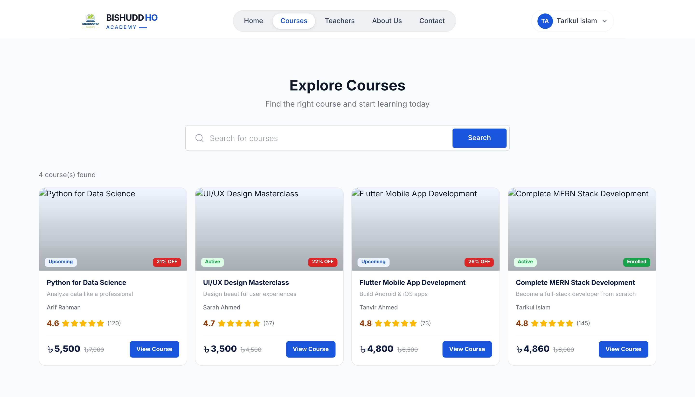
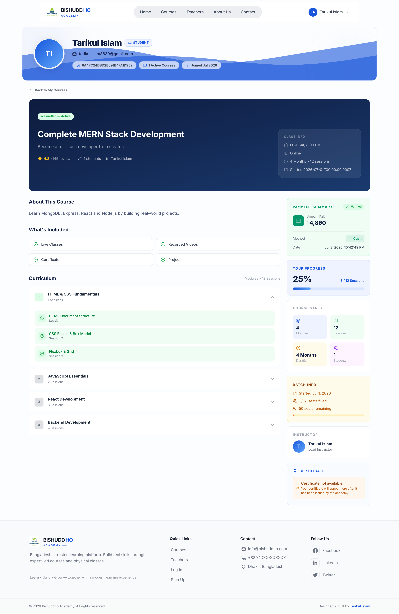
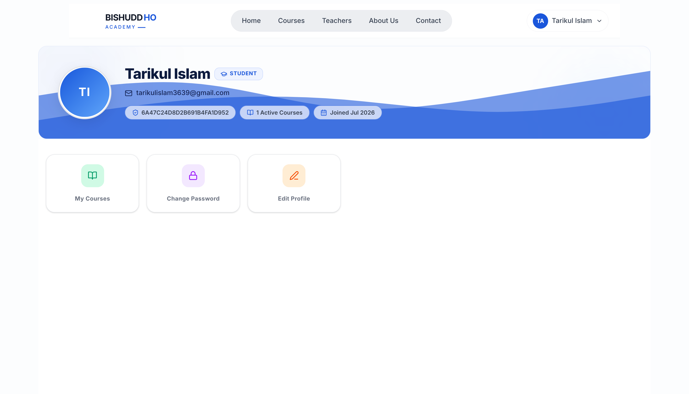
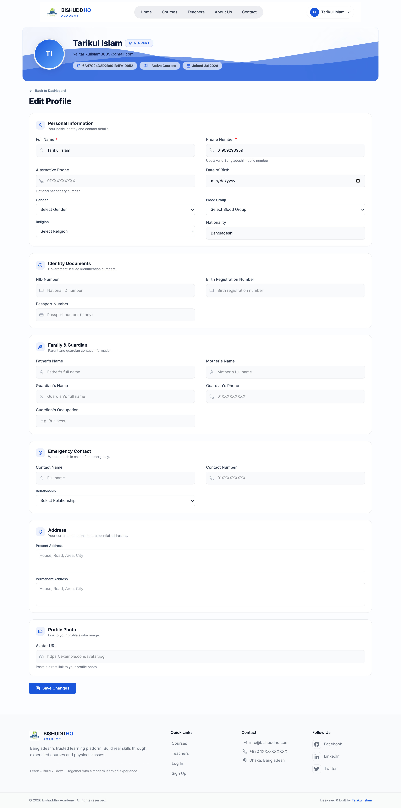
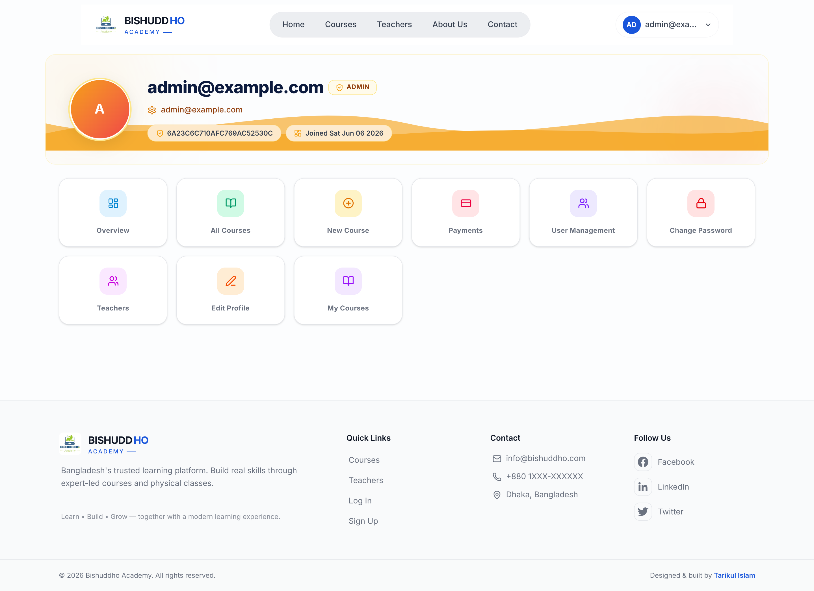
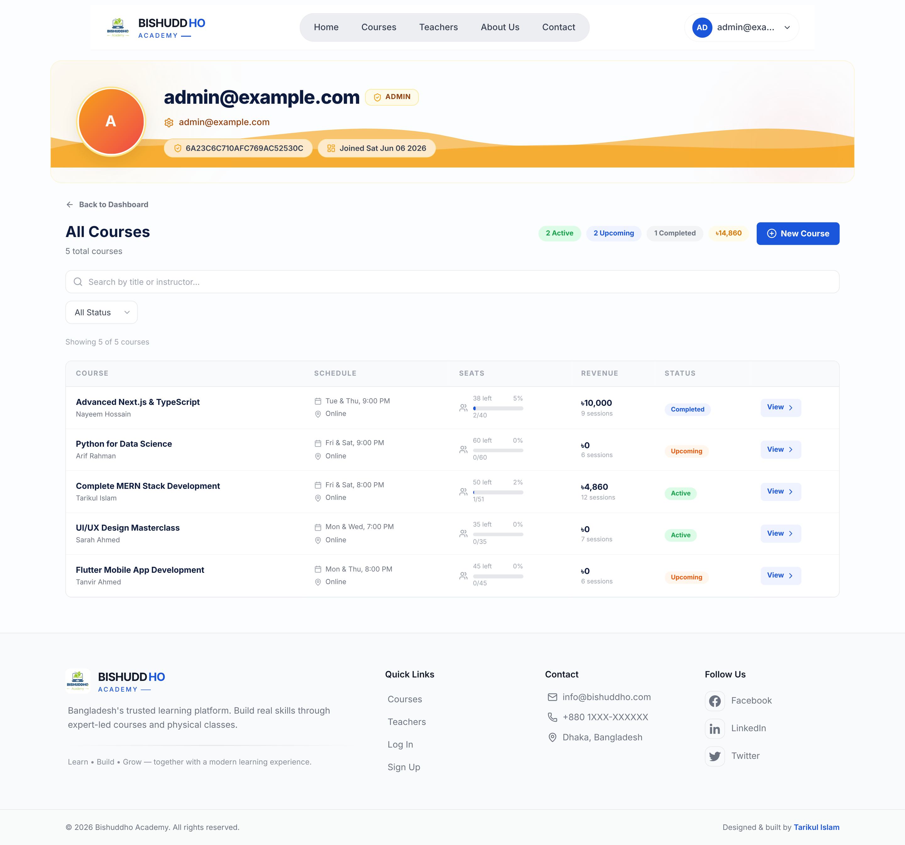
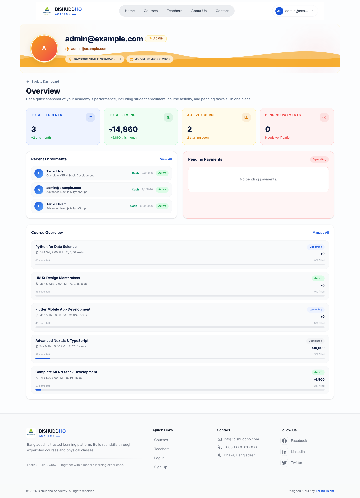
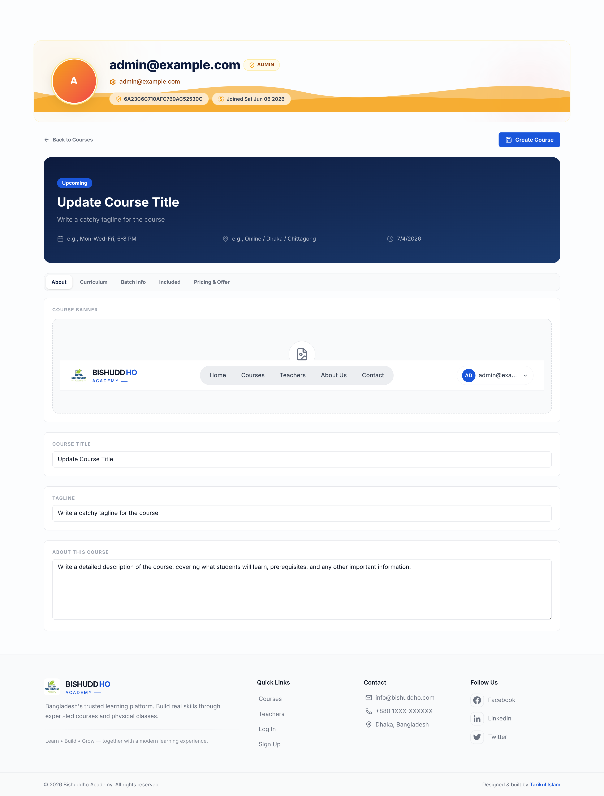

# Bishadho Academy

A comprehensive full-stack EdTech platform for course management, student enrollment, and online learning. Built with modern technologies to provide a seamless experience for administrators, instructors, and students.

## Features

- **Course Management**: Create, update, and manage courses with detailed curriculum
- **Student Enrollment**: Secure enrollment system with payment integration (bKash, Nagad, Rocket, Bank Transfer, Cash)
- **Teacher Profiles**: Detailed instructor profiles with bios, qualifications, and social links
- **Admin Dashboard**: Comprehensive analytics and management tools
- **Student Dashboard**: Personalized learning interface with course progress tracking
- **Authentication System**: Secure JWT-based authentication with role-based access control
- **Responsive Design**: Fully responsive interface across all device sizes
- **Real-time Updates**: Live notifications and updates
- **Content Management**: Easy creation and organization of learning materials
- **Assessment Tools**: Quiz and assignment management
- **Communication System**: Built-in messaging and announcements

## Tech Stack

### Frontend
- **Framework**: Next.js 13+ (App Router)
- **Language**: TypeScript
- **State Management**: Redux Toolkit with RTK Query
- **Styling**: Tailwind CSS
- **UI Components**: Custom components with Framer Motion animations
- **Icons**: Lucide React
- **Form Validation**: Custom validation with regex patterns
- **HTTP Client**: RTK Query for API requests

### Backend
- **Framework**: NestJS
- **Language**: TypeScript
- **Database**: MongoDB with Mongoose ODM
- **Authentication**: JWT (JSON Web Tokens) with HttpOnly cookies
- **Validation**: Class-Validator and Class-Transformer
- **API Documentation**: Swagger/OpenAPI
- **Security**: Helmet, CORS, Rate Limiting
- **File Upload**: Multer for handling

### DevOps & Tools
- **Version Control**: Git & GitHub
- **Package Manager**: npm
- **Linting**: ESLint
- **Code Formatting**: Prettier
- **Environment Variables**: dotenv
- **Testing**: Jest (backend), React Testing Library (frontend)

## Installation

### Prerequisites
- Node.js (v18 or higher)
- MongoDB (v5 or higher)
- npm or yarn

### Backend Setup
1. Navigate to the server directory:
   ```bash
   cd server-repo
   ```
2. Install dependencies:
   ```bash
   npm install
   ```
3. Create a `.env` file based on `.env.example`:
   ```bash
   cp .env.example .env
   ```
4. Configure environment variables (see Environment Variables section below)
5. Start the development server:
   ```bash
   npm run dev
   ```

### Frontend Setup
1. Navigate to the client directory:
   ```bash
   cd client-repo
   ```
2. Install dependencies:
   ```bash
   npm install
   ```
3. Create a `.env.local` file:
   ```bash
   touch .env.local
   ```
4. Add required environment variables (see Environment Variables section below)
5. Start the development server:
   ```bash
   npm run dev
   ```

## Environment Variables

### Backend (`.env` in server-repo)
```
# Server Configuration
PORT=5000
NODE_ENV=development

# Database
MONGODB_URI=mongodb://localhost:27017/bishuddho-academy

# JWT Security
JWT_ACCESS_SECRET=your_super_secret_key_here
JWT_ACCESS_EXPIRES_IN=7d
JWT_REFRESH_SECRET=your_refresh_secret_key_here
JWT_REFRESH_EXPIRES_IN=30d

# Cookie Settings
COOKIE_NAME=access_token
COOKIE_HTTPONLY=true
COOKIE_SECURE=false  # Set to true in production with HTTPS

# File Upload
UPLOAD_DIR=uploads
MAX_FILE_SIZE=5242880  # 5MB

# Email (if applicable)
EMAIL_HOST=smtp.gmail.com
EMAIL_PORT=587
EMAIL_USER=your_email@gmail.com
EMAIL_PASS=your_app_password
```

### Frontend (`.env.local` in client-repo)
```
# API Base URL
NEXT_PUBLIC_API_URL=http://localhost:5000

# Next.js Configuration
NEXT_PUBLIC_APP_URL=http://localhost:3000
```

## Running Locally

### Development Mode
1. Start the backend server:
   ```bash
   # In server-repo
   npm run dev
   ```
2. Start the frontend development server:
   ```bash
   # In client-repo
   npm run dev
   ```
3. Access the application at [http://localhost:3000](http://localhost:3000)

### Production Build
1. Build the backend:
   ```bash
   # In server-repo
   npm run build
   ```
2. Build the frontend:
   ```bash
   # In client-repo
   npm run build
   ```
3. Start both servers in production mode:
   ```bash
   # In server-repo
   npm start
   ```
   ```bash
   # In client-repo
   npm start
   ```

## Build Commands

### Backend
- `npm run build` - Compiles TypeScript to JavaScript
- `npm start` - Runs the compiled application
- `npm run dev` - Starts development server with hot reload
- `npm run lint` - Runs ESLint for code quality
- `npm run test` - Runs Jest tests

### Frontend
- `npm run dev` - Starts Next.js development server
- `npm run build` - Creates optimized production build
- `npm start` - Runs the production build
- `npm run lint` - Runs ESLint
- `npm run test` - Runs Jest tests

## Folder Structure

### Backend (server-repo)
```
src/
├── modules/              # Feature modules (Auth, Courses, Teachers, etc.)
│   ├── auth/             # Authentication module
│   ├── courses/          # Course management
│   ├── teachers/         # Teacher management (to be implemented)
│   └── ...               # Other modules
├── database/             # Database schemas and connection
├── config/               # Configuration files
├── guards/               # Authentication guards
├── decorators/           # Custom decorators
├── dto/                  # Data Transfer Objects
├── services/             # Service layer
└── main.ts               # Application entry point
```

### Frontend (client-repo)
```
src/
├── app/                  # Next.js 13+ app directory
│   ├── (public)/         # Public routes (landing, auth, etc.)
│   ├── admin/            # Admin dashboard routes
│   ├── student/          # Student dashboard routes
│   └── ...               # Other route groups
├── components/           # Reusable UI components
├── redux/                # Redux store configuration
│   ├── features/         # Feature slices (auth, courses, teachers, etc.)
│   ├── api/              # RTK Query API slices
│   └── store.ts          # Store configuration
├── types/                # TypeScript type definitions
├── lib/                  # Utility functions
└── styles/               # Global styles and CSS
```

## Screenshots

Below are screenshots showcasing various parts of the application:

<table>
  <tr>
    <td align="center">
      
      <br><em>Home Page - Landing page with course listings and featured sections</em>
    </td>
    <td align="center">
      
      <br><em>Courses Page - Browse and search available courses</em>
    </td>
    <td align="center">
      
      <br><em>Course Details - Detailed view of a specific course</em>
    </td>
  </tr>
  <tr>
    <td align="center">
      
      <br><em>Student Dashboard - Personalized learning interface</em>
    </td>
    <td align="center">
      
      <br><em>Profile Edit - User profile management</em>
    </td>
    <td align="center">
      
      <br><em>Admin Dashboard - Overview of platform statistics</em>
    </td>
  </tr>
  <tr>
    <td align="center">
      
      <br><em>Course Management - Admin course listing and controls</em>
    </td>
    <td align="center">
      
      <br><em>Admin Overview - Detailed analytics and reports</em>
    </td>
    <td align="center">
      
      <br><em>Add Course - Create new courses with curriculum builder</em>
    </td>
  </tr>
  <tr>
    <td align="center" colspan="3">
      
      <br><em>Contact Page - Get in touch with support and administration</em>
    </td>
  </tr>
</table>

## Future Improvements

- [ ] Mobile applications (React Native) for iOS and Android
- [ ] Advanced analytics dashboard with predictive insights
- [ ] Gamification features (badges, points, leaderboards)
- [ ] Integration with popular LMS platforms (Moodle, Canvas)
- [ ] AI-powered course recommendations and learning path generation
- [ ] Live classroom integration with WebRTC
- [ ] Multi-language support (i18n) for global accessibility
- [ ] Certificate generation with blockchain verification
- [ ] Payment gateway integration (Stripe, PayPal, local gateways)
- [ ] Advanced reporting and export capabilities (PDF, Excel)

## License

This project is licensed under the MIT License - see the [LICENSE](LICENSE) file for details.

## Credits

**Created by**

**Tarikul Islam**

Portfolio:
https://tarikul-islam.me

---

*Built with ❤️ for empowering education through technology*